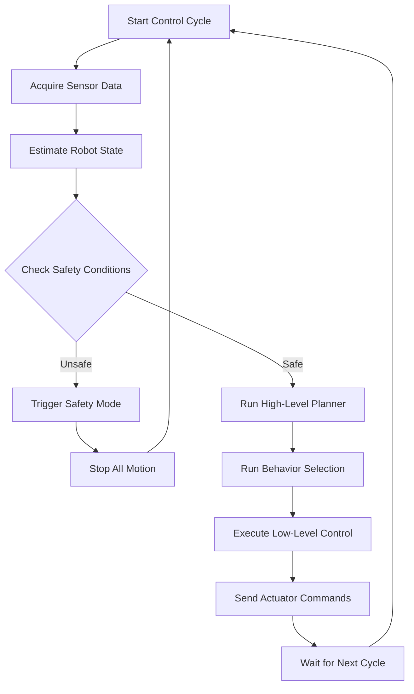
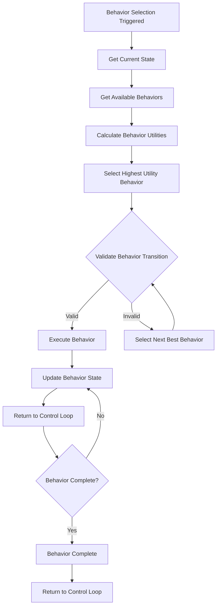
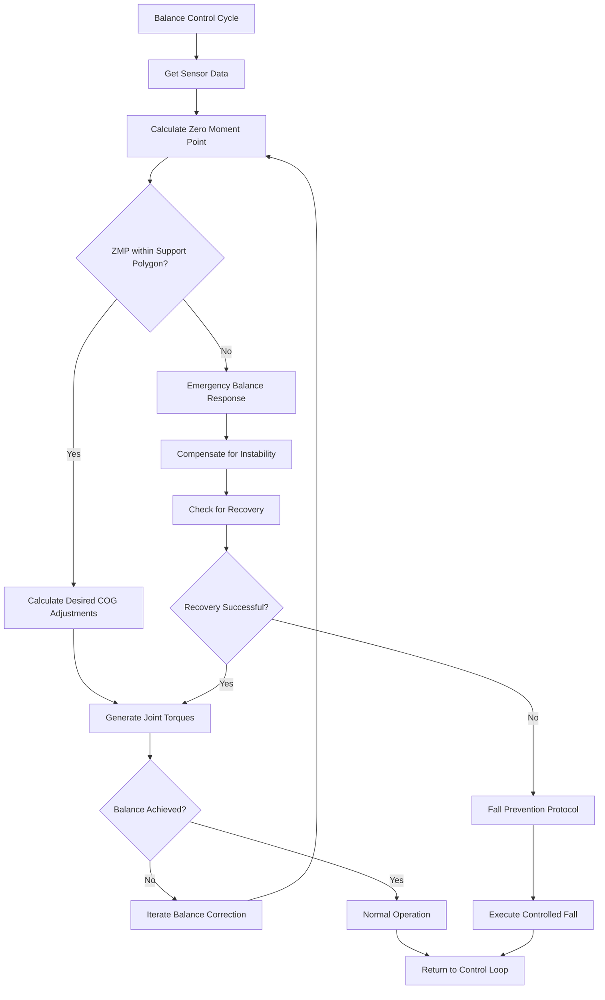
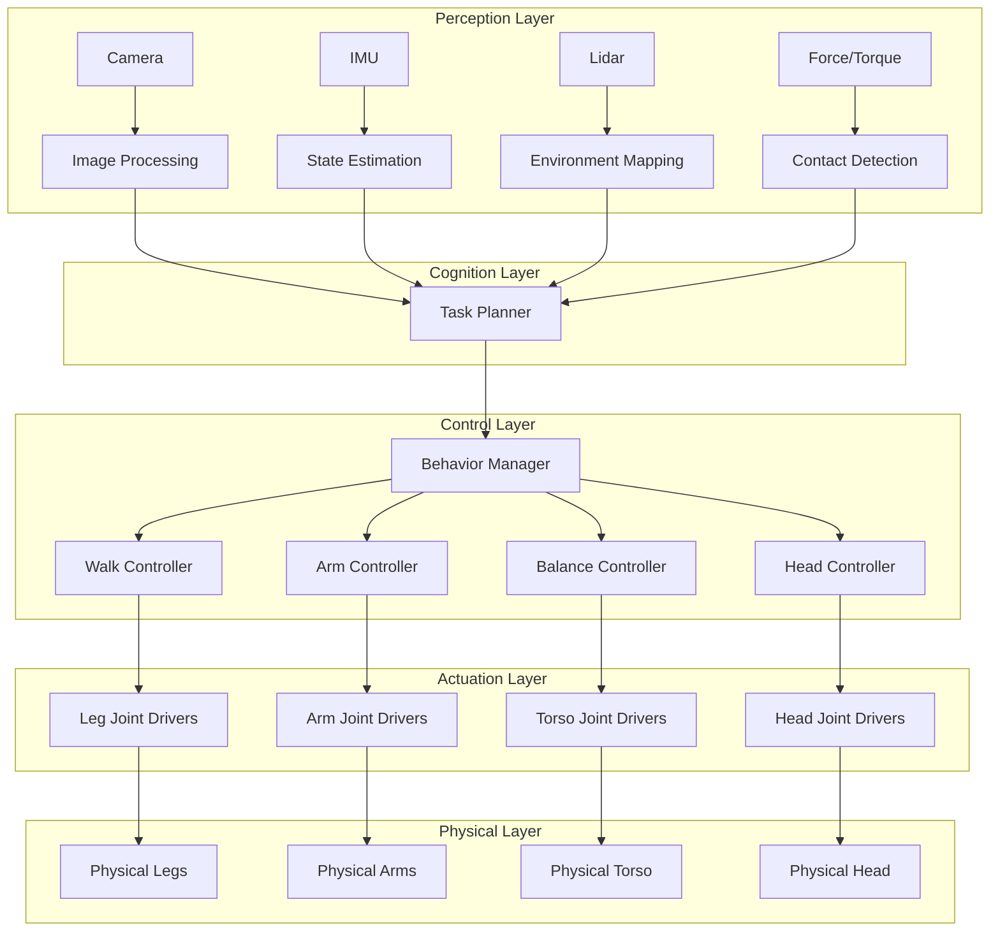
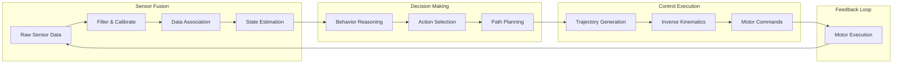
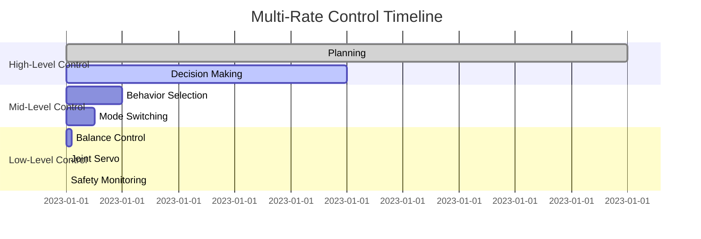
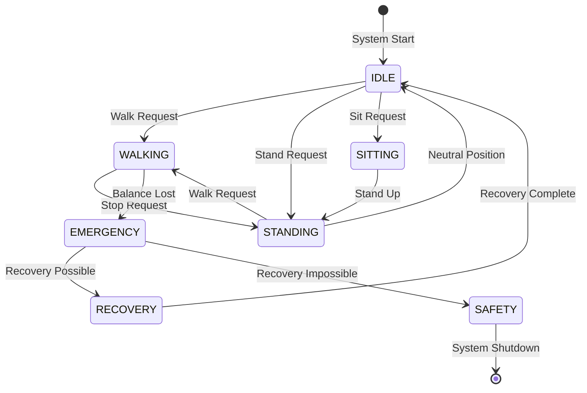
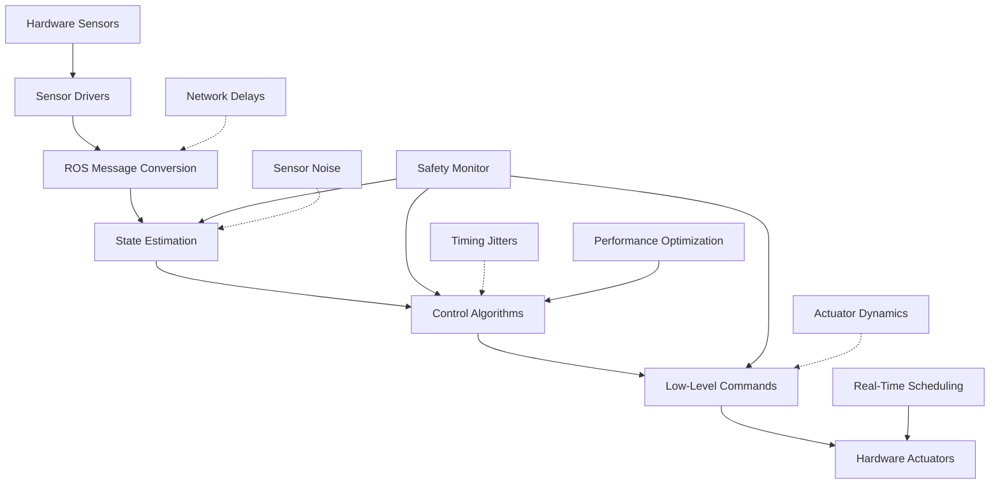

# Chapter 5: Control Architectures and System Integration for Humanoid Robotics

## 5.1 Introduction to Control Architectures

Humanoid robotics control architectures are complex hierarchical systems that coordinate multiple levels of control, from low-level motor commands to high-level task planning. These architectures must balance real-time performance, safety, adaptability, and modularity while managing the intricate dynamics of human-like robots.

The control hierarchy typically consists of multiple layers:
- **High-level cognitive control**: Task planning, decision making, and goal selection
- **Mid-level behavioral control**: Mode switching, behavior selection, and coordination
- **Low-level motor control**: Joint control, balance maintenance, and trajectory execution

## 5.2 Hierarchical Control Architecture

### 5.2.1 Three-Tier Control Architecture

```
                    ┌─────────────────────────────────┐
                    │    HIGH-LEVEL CONTROLLER        │
                    │  (Task Planning & Reasoning)    │
                    │  • Goal selection               │
                    │  • Task decomposition           │
                    │  • Motion planning              │
                    │  • Decision making              │
                    └─────────────┬───────────────────┘
                                  │
                    ┌─────────────▼─────────────┐
                    │     MID-LEVEL CONTROLLER  │
                    │  (Behavior & Coordination)│
                    │  • Behavior selection     │
                    │  • Mode switching         │
                    │  • Inter-task coordination│
                    │  • Safety monitoring      │
                    └─────────────┬─────────────┘
                                  │
         ┌────────────────────────▼────────────────────────┐
         │              LOW-LEVEL CONTROLLER              │
         │           (Motor & Balance Control)            │
         │  ┌─────────────────┐  ┌──────────────────────┐ │
         │  │ JOINT CONTROLLER│  │ BALANCE CONTROLLER   │ │
         │  │ • Torque control│  │ • COG control        │ │
         │  │ • Position hold │  │ • ZMP regulation     │ │
         │  │ • Compliance    │  │ • Fall prevention    │ │
         │  └─────────────────┘  └──────────────────────┘ │
         │  ┌─────────────────┐  ┌──────────────────────┐ │
         │  │ WALK CONTROLLER │  │ MANIPULATION         │ │
         │  │ • Step planning │  │ • Inverse kinematics │ │
         │  │ • Foot placement│  │ • Grasp planning     │ │
         │  │ • Gait control  │  │ • Trajectory gen.    │ │
         │  └─────────────────┘  └──────────────────────┘ │
         └────────────────────────────────────────────────┘
```

### 5.2.2 Detailed Component Breakdown

Let's examine each level in detail with their interactions and dependencies:

**High-Level Controller Components:**
- Task Planner: Generates high-level plans based on goals
- State Estimator: Maintains world model and robot state
- Decision Maker: Selects appropriate behaviors
- Trajectory Generator: Creates reference trajectories

**Mid-Level Controller Components:**
- Behavior Manager: Coordinates active behaviors
- Mode Selector: Manages state transitions
- Safety Supervisor: Monitors and enforces safety
- Resource Allocator: Distributes computational resources

**Low-Level Controller Components:**
- Joint Controllers: Individual joint servo control
- Balance Controller: Whole-body balance maintenance
- Walk Controller: Locomotion pattern generation
- Manipulation Controller: Arm and hand control

## 5.3 Control System Flowcharts

### 5.3.1 Main Control Loop Flowchart



### 5.3.2 Behavior Selection Flowchart



### 5.3.3 Balance Control Flowchart



## 5.4 System Integration Architecture

### 5.4.1 Component Integration Flow



### 5.4.2 Data Flow Architecture



## 5.5 Real-Time Control Architectures

### 5.5.1 Multi-Rate Control System

Humanoid robots require different control rates for different subsystems:



### 5.5.2 Hierarchical State Machine



## 5.6 Software Architecture Patterns

### 5.6.1 Component-Based Architecture

```mermaid
componentDiagram
    component "PerceptionManager" as PM
    component "MotionPlanner" as MP  
    component "Balancer" as B
    component "WalkController" as WC
    component "JointController" as JC
    component "SafetyMonitor" as SM
    
    PM --> MP : sensor_data
    MP --> B : target_pose
    MP --> WC : walk_command
    B --> JC : joint_commands
    WC --> JC : step_parameters
    SM --> B : safety_limits
    SM --> WC : safety_limits
    SM --> JC : emergency_stop
```

### 5.6.2 Publish-Subscribe Pattern Implementation

```python
#!/usr/bin/env python3
"""
Publish-Subscribe pattern for humanoid control system
Demonstrates decoupled communication between components
"""

import time
import threading
from typing import Dict, List, Callable
from dataclasses import dataclass
from enum import Enum

class MessageType(Enum):
    SENSOR_DATA = "sensor_data"
    CONTROL_COMMAND = "control_command"
    SYSTEM_STATE = "system_state"
    BEHAVIOR_REQUEST = "behavior_request"
    SAFETY_ALERT = "safety_alert"

@dataclass
class Message:
    msg_type: MessageType
    data: dict
    timestamp: float
    sender: str

class EventBus:
    """Central event bus for message passing"""
    def __init__(self):
        self.subscribers: Dict[MessageType, List[Callable]] = {}
        self.lock = threading.Lock()
        
    def subscribe(self, msg_type: MessageType, callback: Callable):
        """Subscribe to a message type"""
        with self.lock:
            if msg_type not in self.subscribers:
                self.subscribers[msg_type] = []
            self.subscribers[msg_type].append(callback)
    
    def publish(self, message: Message):
        """Publish a message to all subscribers"""
        with self.lock:
            callbacks = self.subscribers.get(message.msg_type, [])
        
        for callback in callbacks:
            try:
                callback(message)
            except Exception as e:
                print(f"Error in subscriber callback: {e}")

class SensorManager:
    """Component that manages sensor data"""
    def __init__(self, event_bus: EventBus):
        self.event_bus = event_bus
        self.event_bus.subscribe(MessageType.BEHAVIOR_REQUEST, self.handle_behavior_request)
        self.running = False
    
    def start(self):
        """Start sensor data acquisition"""
        self.running = True
        self.sensor_thread = threading.Thread(target=self.sensor_loop)
        self.sensor_thread.start()
    
    def sensor_loop(self):
        """Main sensor acquisition loop"""
        while self.running:
            # Simulate sensor data
            sensor_data = {
                'joint_positions': [0.1, 0.2, 0.3, 0.4, 0.5, 0.6],
                'imu_data': {'roll': 0.01, 'pitch': 0.02, 'yaw': 0.03},
                'force_sensors': [10, 15, 20, 25],
                'camera_data': {'objects': [], 'distances': []}
            }
            
            msg = Message(
                msg_type=MessageType.SENSOR_DATA,
                data=sensor_data,
                timestamp=time.time(),
                sender='SensorManager'
            )
            self.event_bus.publish(msg)
            
            time.sleep(0.01)  # 100Hz sensor update
    
    def handle_behavior_request(self, message: Message):
        """Handle behavior requests that might affect sensor focus"""
        print(f"SensorManager received behavior request: {message.data}")

class MotionPlanner:
    """Component that plans robot motion"""
    def __init__(self, event_bus: EventBus):
        self.event_bus = event_bus
        self.event_bus.subscribe(MessageType.SENSOR_DATA, self.process_sensor_data)
        self.event_bus.subscribe(MessageType.BEHAVIOR_REQUEST, self.handle_behavior_request)
        
        self.current_behavior = "idle"
        self.goal_position = [0, 0, 0]
        
    def process_sensor_data(self, message: Message):
        """Process incoming sensor data to update plans"""
        if self.current_behavior == "walking":
            # Simple walking logic
            sensor_data = message.data
            current_pos = sensor_data['joint_positions'][:3]  # First 3 joints represent position
            
            # Simple gait control
            if abs(current_pos[0] - self.goal_position[0]) > 0.1:
                walk_command = {
                    'step_length': 0.2,
                    'step_height': 0.05,
                    'direction': 'forward'
                }
                
                cmd_msg = Message(
                    msg_type=MessageType.CONTROL_COMMAND,
                    data=walk_command,
                    timestamp=time.time(),
                    sender='MotionPlanner'
                )
                self.event_bus.publish(cmd_msg)
    
    def handle_behavior_request(self, message: Message):
        """Handle behavior change requests"""
        behavior = message.data.get('behavior', 'idle')
        self.current_behavior = behavior
        
        if behavior == 'walk':
            self.goal_position = message.data.get('goal', [1.0, 0, 0])
        elif behavior == 'stand':
            self.goal_position = [0, 0, 0]

class BalanceController:
    """Component that maintains robot balance"""
    def __init__(self, event_bus: EventBus):
        self.event_bus = event_bus
        self.event_bus.subscribe(MessageType.SENSOR_DATA, self.process_sensor_data)
        self.event_bus.subscribe(MessageType.CONTROL_COMMAND, self.handle_control_command)
        
        self.zmp_reference = [0, 0]
        self.balance_gain = 10.0
    
    def process_sensor_data(self, message: Message):
        """Process sensor data for balance control"""
        sensor_data = message.data
        imu_data = sensor_data.get('imu_data', {})
        
        # Calculate balance correction
        pitch_error = imu_data.get('pitch', 0)
        roll_error = imu_data.get('roll', 0)
        
        # Simple balance correction
        balance_correction = {
            'torso_pitch': -pitch_error * self.balance_gain,
            'torso_roll': -roll_error * self.balance_gain
        }
        
        # Check if emergency balance is needed
        if abs(pitch_error) > 0.2 or abs(roll_error) > 0.2:
            safety_msg = Message(
                msg_type=MessageType.SAFETY_ALERT,
                data={'level': 'high', 'reason': 'Imminent fall'},
                timestamp=time.time(),
                sender='BalanceController'
            )
            self.event_bus.publish(safety_msg)
        
        cmd_msg = Message(
            msg_type=MessageType.CONTROL_COMMAND,
            data=balance_correction,
            timestamp=time.time(),
            sender='BalanceController'
        )
        self.event_bus.publish(cmd_msg)
    
    def handle_control_command(self, message: Message):
        """Handle control commands that affect balance"""
        if 'balance_params' in message.data:
            for param, value in message.data['balance_params'].items():
                setattr(self, param, value)

class SafetyMonitor:
    """Component that monitors system safety"""
    def __init__(self, event_bus: EventBus):
        self.event_bus = event_bus
        self.event_bus.subscribe(MessageType.SENSOR_DATA, self.monitor_sensors)
        self.event_bus.subscribe(MessageType.SAFETY_ALERT, self.handle_safety_alert)
        
        self.safety_limits = {
            'joint_position': 1.5,
            'imu_angle': 0.3,
            'current_draw': 10.0
        }
        self.system_safe = True
    
    def monitor_sensors(self, message: Message):
        """Monitor sensor data for safety violations"""
        sensor_data = message.data
        
        # Check joint positions
        joint_positions = sensor_data.get('joint_positions', [])
        for pos in joint_positions:
            if abs(pos) > self.safety_limits['joint_position']:
                self.trigger_safety_alert(f"Joint position limit exceeded: {pos}")
        
        # Check IMU data
        imu_data = sensor_data.get('imu_data', {})
        pitch = imu_data.get('pitch', 0)
        roll = imu_data.get('roll', 0)
        
        if abs(pitch) > self.safety_limits['imu_angle'] or abs(roll) > self.safety_limits['imu_angle']:
            self.trigger_safety_alert(f"IMU angle exceeded: pitch={pitch}, roll={roll}")
    
    def trigger_safety_alert(self, reason):
        """Trigger a safety alert"""
        safety_msg = Message(
            msg_type=MessageType.SAFETY_ALERT,
            data={'level': 'medium', 'reason': reason},
            timestamp=time.time(),
            sender='SafetyMonitor'
        )
        self.event_bus.publish(safety_msg)
    
    def handle_safety_alert(self, message: Message):
        """Handle incoming safety alerts"""
        alert_data = message.data
        print(f"SAFETY ALERT [{alert_data['level']}]: {alert_data['reason']}")
        
        if alert_data['level'] == 'high':
            # Send emergency stop
            stop_msg = Message(
                msg_type=MessageType.CONTROL_COMMAND,
                data={'command': 'emergency_stop'},
                timestamp=time.time(),
                sender='SafetyMonitor'
            )
            self.event_bus.publish(stop_msg)

def main():
    """Main system demonstration"""
    print("Initializing humanoid control system...")
    
    # Create event bus
    event_bus = EventBus()
    
    # Create components
    sensor_manager = SensorManager(event_bus)
    motion_planner = MotionPlanner(event_bus)
    balance_controller = BalanceController(event_bus)
    safety_monitor = SafetyMonitor(event_bus)
    
    # Start sensor manager
    sensor_manager.start()
    
    # Send a behavior request to start walking
    walk_request = Message(
        msg_type=MessageType.BEHAVIOR_REQUEST,
        data={'behavior': 'walk', 'goal': [2.0, 0, 0]},
        timestamp=time.time(),
        sender='User'
    )
    event_bus.publish(walk_request)
    
    # Run for a while
    time.sleep(5)
    
    # Stop
    sensor_manager.running = False
    print("System stopped.")

if __name__ == "__main__":
    main()
```

### 5.6.3 Hierarchical Task Decomposition

```python
#!/usr/bin/env python3
"""
Hierarchical task decomposition system for humanoid robotics
Demonstrates how complex tasks are broken down into simpler subtasks
"""

from enum import Enum
from dataclasses import dataclass
from typing import List, Optional, Dict, Any
import time

class TaskStatus(Enum):
    PENDING = "pending"
    RUNNING = "running"
    SUCCESS = "success"
    FAILED = "failed"
    CANCELLED = "cancelled"

@dataclass
class Task:
    """Base class for tasks in the hierarchy"""
    id: str
    name: str
    description: str
    status: TaskStatus = TaskStatus.PENDING
    priority: int = 0
    subtasks: List['Task'] = None
    dependencies: List[str] = None
    estimated_duration: float = 0.0
    actual_duration: float = 0.0
    
    def __post_init__(self):
        if self.subtasks is None:
            self.subtasks = []
        if self.dependencies is None:
            self.dependencies = []

class TaskManager:
    """Manages hierarchical task execution"""
    def __init__(self):
        self.tasks: Dict[str, Task] = {}
        self.active_tasks: List[str] = []
        self.completed_tasks: List[str] = []
        
    def add_task(self, task: Task):
        """Add a task to the system"""
        self.tasks[task.id] = task
        
    def execute_task(self, task_id: str) -> TaskStatus:
        """Execute a single task"""
        if task_id not in self.tasks:
            return TaskStatus.FAILED
            
        task = self.tasks[task_id]
        
        # Check dependencies
        for dep_id in task.dependencies:
            if dep_id not in self.completed_tasks:
                return TaskStatus.PENDING
        
        print(f"Executing task: {task.name}")
        task.status = TaskStatus.RUNNING
        
        start_time = time.time()
        
        # Execute task based on type
        
        # For subtasks, execute them first
        for subtask in task.subtasks:
            subtask_status = self.execute_task(subtask.id)
            if subtask_status != TaskStatus.SUCCESS:
                task.status = TaskStatus.FAILED
                task.actual_duration = time.time() - start_time
                return task.status
        
        # Simulate task execution
        if len(task.subtasks) == 0:
            # Leaf task - actually do something
            if "walk" in task.name.lower():
                # Simulate walking
                time.sleep(0.5)
            elif "grasp" in task.name.lower():
                # Simulate grasping
                time.sleep(0.3)
            elif "speak" in task.name.lower():
                # Simulate speaking
                time.sleep(0.2)
        
        task.status = TaskStatus.SUCCESS
        task.actual_duration = time.time() - start_time
        self.completed_tasks.append(task_id)
        
        print(f"Task completed: {task.name}")
        return task.status
    
    def execute_task_tree(self, root_task_id: str):
        """Execute entire task tree starting from root"""
        print(f"Starting execution of task tree: {root_task_id}")
        
        # Build execution order considering dependencies
        execution_order = self._get_execution_order(root_task_id)
        
        for task_id in execution_order:
            status = self.execute_task(task_id)
            if status == TaskStatus.FAILED:
                print(f"Task tree failed at task: {task_id}")
                return False
        
        print("Task tree completed successfully")
        return True
    
    def _get_execution_order(self, root_task_id: str) -> List[str]:
        """Determine execution order considering dependencies"""
        order = []
        visited = set()
        
        def dfs(task_id: str):
            if task_id in visited:
                return
            visited.add(task_id)
            
            # Visit dependencies first
            task = self.tasks[task_id]
            for dep_id in task.dependencies:
                if dep_id in self.tasks:
                    dfs(dep_id)
            
            # Visit subtasks in order
            for subtask in task.subtasks:
                dfs(subtask.id)
            
            # Add current task
            order.append(task_id)
        
        dfs(root_task_id)
        return order

def create_sample_task_tree():
    """Create a sample task tree for a complex humanoid task"""
    tm = TaskManager()
    
    # Define low-level tasks
    walk_forward = Task(
        id="walk_1",
        name="Walk Forward",
        description="Move robot forward by 1 meter",
        estimated_duration=2.0
    )
    
    turn_left = Task(
        id="turn_1", 
        name="Turn Left",
        description="Turn robot 90 degrees left",
        estimated_duration=1.0
    )
    
    approach_object = Task(
        id="approach_1",
        name="Approach Object", 
        description="Move to object location",
        estimated_duration=1.0
    )
    
    grasp_object = Task(
        id="grasp_1",
        name="Grasp Object",
        description="Grasp the target object",
        estimated_duration=0.5
    )
    
    raise_arm = Task(
        id="raise_arm_1",
        name="Raise Right Arm",
        description="Raise right arm to head height",
        estimated_duration=0.3
    )
    
    speak_hello = Task(
        id="speak_1",
        name="Speak Hello",
        description="Speak 'Hello' to person",
        estimated_duration=0.5
    )
    
    # Define mid-level tasks
    navigate_to_object = Task(
        id="navigate_1",
        name="Navigate to Object",
        description="Navigate robot to object location",
        subtasks=[walk_forward, turn_left, approach_object],
        estimated_duration=4.0
    )
    
    pickup_object = Task(
        id="pickup_1", 
        name="Pick Up Object",
        description="Pick up the target object",
        subtasks=[navigate_to_object, grasp_object],
        dependencies=["navigate_1"],
        estimated_duration=4.5
    )
    
    # Define high-level tasks
    greet_and_assist = Task(
        id="greet_assist_1",
        name="Greet and Assist Person",
        description="Greet person and assist with object",
        subtasks=[raise_arm, speak_hello, pickup_object],
        estimated_duration=6.0
    )
    
    # Add all tasks to manager
    for task in [walk_forward, turn_left, approach_object, grasp_object, 
                 raise_arm, speak_hello, navigate_to_object, pickup_object,
                 greet_and_assist]:
        tm.add_task(task)
    
    return tm, greet_and_assist.id

def demonstrate_task_hierarchy():
    """Demonstrate the task hierarchy system"""
    tm, root_task_id = create_sample_task_tree()
    
    print("Task Hierarchy Structure:")
    print("========================")
    
    def print_task_tree(task_id: str, indent: int = 0):
        task = tm.tasks[task_id]
        print("  " * indent + f"└─ {task.name} (ID: {task.id})")
        
        for subtask in task.subtasks:
            print_task_tree(subtask.id, indent + 1)
    
    print_task_tree(root_task_id)
    
    print("\nExecuting task tree...")
    success = tm.execute_task_tree(root_task_id)
    
    print(f"\nExecution result: {'Success' if success else 'Failed'}")
    
    # Print task statistics
    print("\nTask Statistics:")
    print("================")
    for task_id, task in tm.tasks.items():
        status_symbol = {
            TaskStatus.SUCCESS: "✓",
            TaskStatus.FAILED: "✗", 
            TaskStatus.CANCELLED: "○",
            TaskStatus.PENDING: "○",
            TaskStatus.RUNNING: "→"
        }[task.status]
        
        print(f"{status_symbol} {task.name}: {task.actual_duration:.2f}s (est: {task.estimated_duration:.2f}s)")

if __name__ == "__main__":
    demonstrate_task_hierarchy()
```

## 5.7 Control System Integration Patterns

### 5.7.1 Service-Oriented Architecture

In ROS2, services provide request-response communication between components:

```python
#!/usr/bin/env python3
"""
ROS2 service integration for humanoid control system
"""

import rclpy
from rclpy.node import Node
from rclpy.qos import QoSProfile
from std_srvs.srv import Trigger, SetBool
from humanoid_robot_interfaces.srv import ExecuteBehavior, SetJointState

class ControlServiceManager(Node):
    def __init__(self):
        super().__init__('control_service_manager')
        
        # Create services
        self.behavior_service = self.create_service(
            ExecuteBehavior,
            'execute_behavior',
            self.execute_behavior_callback
        )
        
        self.joint_control_service = self.create_service(
            SetJointState, 
            'set_joint_state',
            self.set_joint_state_callback
        )
        
        self.emergency_stop_service = self.create_service(
            Trigger,
            'emergency_stop',
            self.emergency_stop_callback
        )
        
        # Create clients for other services
        self.balance_client = self.create_client(SetBool, 'balance_service')
        self.walk_client = self.create_client(ExecuteBehavior, 'walk_behavior')
        
        self.get_logger().info('Control Service Manager initialized')

    def execute_behavior_callback(self, request, response):
        """Handle behavior execution requests"""
        behavior_name = request.behavior_name
        self.get_logger().info(f'Executing behavior: {behavior_name}')
        
        # Execute the requested behavior
        success = self.execute_requested_behavior(behavior_name, request.parameters)
        
        response.success = success
        response.message = f"Behavior {behavior_name} {'executed' if success else 'failed'}"
        
        return response

    def set_joint_state_callback(self, request, response):
        """Handle joint state setting requests"""
        joint_positions = request.positions
        joint_names = request.names
        
        self.get_logger().info(f'Setting {len(joint_names)} joint positions')
        
        # Set joint positions
        success = self.set_joint_positions(joint_names, joint_positions)
        
        response.success = success
        response.message = f"Joint states {'set' if success else 'failed to set'}"
        
        return response

    def emergency_stop_callback(self, request, response):
        """Handle emergency stop requests"""
        self.get_logger().info('EMERGENCY STOP REQUESTED')
        
        # Stop all motion immediately
        self.emergency_stop_all()
        
        response.success = True
        response.message = 'Emergency stop executed'
        
        return response

    def execute_requested_behavior(self, behavior_name, parameters):
        """Execute the requested behavior"""
        # This would contain the actual behavior execution logic
        # For demonstration, we'll just simulate different behaviors
        
        if behavior_name == 'walk':
            return self.execute_walk_behavior(parameters)
        elif behavior_name == 'stand':
            return self.execute_stand_behavior(parameters)
        elif behavior_name == 'sit':
            return self.execute_sit_behavior(parameters)
        else:
            self.get_logger().warn(f'Unknown behavior: {behavior_name}')
            return False

    def set_joint_positions(self, joint_names, positions):
        """Set specified joint positions"""
        # This would interface with the actual joint controllers
        for name, pos in zip(joint_names, positions):
            self.get_logger().debug(f'Setting {name} to {pos} radians')
        return True

    def emergency_stop_all(self):
        """Emergency stop all robot motion"""
        # This would send stop commands to all controllers
        self.get_logger().info('Stopping all robot motion')

    def execute_walk_behavior(self, parameters):
        """Execute walking behavior"""
        # Implementation for walking
        self.get_logger().info('Executing walking behavior')
        return True

    def execute_stand_behavior(self, parameters):
        """Execute standing behavior"""
        # Implementation for standing
        self.get_logger().info('Executing standing behavior')
        return True

    def execute_sit_behavior(self, parameters):
        """Execute sitting behavior"""
        # Implementation for sitting
        self.get_logger().info('Executing sitting behavior')
        return True

def main(args=None):
    rclpy.init(args=args)
    service_manager = ControlServiceManager()
    
    try:
        rclpy.spin(service_manager)
    except KeyboardInterrupt:
        pass
    finally:
        service_manager.destroy_node()
        rclpy.shutdown()

if __name__ == '__main__':
    main()
```

### 5.7.2 Action Server Integration

For long-running tasks, ROS2 actions are more appropriate:

```python
#!/usr/bin/env python3
"""
ROS2 action server for complex humanoid behaviors
"""

import rclpy
from rclpy.action import ActionServer, GoalResponse, CancelResponse
from rclpy.node import Node
from rclpy.executors import MultiThreadedExecutor
from rclpy.callback_groups import ReentrantCallbackGroup
import time
from humanoid_robot_interfaces.action import NavigateToPose

class NavigateActionServer(Node):
    def __init__(self):
        super().__init__('navigate_action_server')
        
        self._action_server = ActionServer(
            self,
            NavigateToPose,
            'navigate_to_pose',
            execute_callback=self.execute_callback,
            goal_callback=self.goal_callback,
            cancel_callback=self.cancel_callback,
            callback_group=ReentrantCallbackGroup()
        )
        
        self.current_goal = None
        self._is_cancel_requested = False
        
        self.get_logger().info('Navigate Action Server initialized')

    def goal_callback(self, goal_request):
        """Accept or reject goal requests"""
        self.get_logger().info(f'Received navigation goal: {goal_request.pose}')
        return GoalResponse.ACCEPT

    def cancel_callback(self, goal_handle):
        """Accept or reject cancel requests"""
        self.get_logger().info('Received cancel request')
        self._is_cancel_requested = True
        return CancelResponse.ACCEPT

    def execute_callback(self, goal_handle):
        """Execute the navigation goal"""
        self.get_logger().info('Starting navigation execution')
        
        feedback_msg = NavigateToPose.Feedback()
        result = NavigateToPose.Result()
        
        target_pose = goal_handle.request.pose
        current_pose = self.get_current_pose()  # Would get from TF or sensors
        
        # Calculate navigation plan
        navigation_path = self.plan_path(current_pose, target_pose)
        
        if not navigation_path:
            goal_handle.abort()
            result.success = False
            result.message = "No valid path found"
            return result
        
        # Execute navigation
        for i, waypoint in enumerate(navigation_path):
            if self._is_cancel_requested:
                goal_handle.canceled()
                result.success = False
                result.message = "Goal canceled"
                self._is_cancel_requested = False
                return result
            
            # Move to waypoint
            success = self.move_to_waypoint(waypoint)
            
            if not success:
                goal_handle.abort()
                result.success = False
                result.message = "Navigation failed at waypoint"
                return result
            
            # Publish feedback
            feedback_msg.current_pose = self.get_current_pose()
            feedback_msg.distance_remaining = self.calculate_distance_remaining(
                self.get_current_pose(), target_pose
            )
            goal_handle.publish_feedback(feedback_msg)
            
            self.get_logger().info(f'Waypoint {i+1}/{len(navigation_path)} completed')
        
        # Final check - reached target?
        final_pose = self.get_current_pose()
        distance_to_target = self.calculate_distance_to_target(final_pose, target_pose)
        
        if distance_to_target < 0.1:  # 10cm tolerance
            goal_handle.succeed()
            result.success = True
            result.message = "Navigation completed successfully"
        else:
            goal_handle.abort()
            result.success = False
            result.message = f"Reached vicinity but not target (distance: {distance_to_target:.2f}m)"
        
        self.get_logger().info(f'Navigation result: {result.message}')
        return result

    def get_current_pose(self):
        """Get current robot pose (would interface with localization system)"""
        # Simulated pose
        from geometry_msgs.msg import Pose
        pose = Pose()
        pose.position.x = 0.0
        pose.position.y = 0.0
        pose.position.z = 0.0
        pose.orientation.w = 1.0
        return pose

    def plan_path(self, start_pose, end_pose):
        """Plan a path from start to end pose"""
        # Simple straight-line path for demonstration
        path = []
        for i in range(10):  # 10 waypoints
            t = i / 9.0  # Parameter from 0 to 1
            waypoint = Pose()
            waypoint.position.x = start_pose.position.x + t * (end_pose.position.x - start_pose.position.x)
            waypoint.position.y = start_pose.position.y + t * (end_pose.position.y - start_pose.position.y)
            waypoint.orientation = end_pose.orientation
            path.append(waypoint)
        return path

    def move_to_waypoint(self, waypoint):
        """Move robot to specified waypoint"""
        # Simulate movement
        time.sleep(0.2)
        return True

    def calculate_distance_remaining(self, current_pose, target_pose):
        """Calculate remaining distance to target"""
        dx = target_pose.position.x - current_pose.position.x
        dy = target_pose.position.y - current_pose.position.y
        return (dx**2 + dy**2)**0.5

    def calculate_distance_to_target(self, current_pose, target_pose):
        """Calculate distance to target pose"""
        return self.calculate_distance_remaining(current_pose, target_pose)

def main(args=None):
    rclpy.init(args=args)
    
    node = NavigateActionServer()
    executor = MultiThreadedExecutor()
    executor.add_node(node)
    
    try:
        executor.spin()
    except KeyboardInterrupt:
        pass
    finally:
        node.destroy_node()
        rclpy.shutdown()

if __name__ == '__main__':
    main()
```

## 5.8 Integration Testing and Validation

### 5.8.1 System Integration Test Framework

```python
#!/usr/bin/env python3
"""
Integration test framework for humanoid control system
"""

import unittest
import threading
import time
from unittest.mock import Mock, patch
import numpy as np

class MockSensorInterface:
    """Mock sensor interface for testing"""
    def __init__(self):
        self.joint_positions = [0.0] * 28  # 28 DOF humanoid
        self.imu_data = {'roll': 0.0, 'pitch': 0.0, 'yaw': 0.0}
        self.force_data = [0.0, 0.0, 0.0, 0.0]  # 4 force sensors
    
    def get_sensor_data(self):
        """Get mock sensor data"""
        return {
            'joint_positions': self.joint_positions,
            'imu_data': self.imu_data,
            'force_data': self.force_data
        }

class MockActuatorInterface:
    """Mock actuator interface for testing"""
    def __init__(self):
        self.command_history = []
    
    def send_commands(self, commands):
        """Send commands to actuators"""
        self.command_history.append(commands)
        return True

class HumanoidControlSystem:
    """Simplified humanoid control system for testing"""
    def __init__(self, sensor_interface, actuator_interface):
        self.sensor_interface = sensor_interface
        self.actuator_interface = actuator_interface
        self.running = False
        self.balance_controller = MockBalanceController()
        self.walk_controller = MockWalkController()
    
    def start(self):
        """Start the control system"""
        self.running = True
        self.control_thread = threading.Thread(target=self.control_loop)
        self.control_thread.start()
    
    def control_loop(self):
        """Main control loop"""
        while self.running:
            # Get sensor data
            sensor_data = self.sensor_interface.get_sensor_data()
            
            # Process with controllers
            balance_commands = self.balance_controller.update(sensor_data)
            walk_commands = self.walk_controller.update(sensor_data)
            
            # Combine commands
            combined_commands = self.combine_commands(balance_commands, walk_commands)
            
            # Send to actuators
            self.actuator_interface.send_commands(combined_commands)
            
            time.sleep(0.01)  # 100Hz control loop
    
    def combine_commands(self, balance_cmds, walk_cmds):
        """Combine different controller commands"""
        # Simple blending for demonstration
        return balance_cmds + walk_cmds
    
    def stop(self):
        """Stop the control system"""
        self.running = False
        if hasattr(self, 'control_thread'):
            self.control_thread.join()

class MockBalanceController:
    """Mock balance controller"""
    def update(self, sensor_data):
        """Update balance control"""
        # Simple balance response
        imu = sensor_data['imu_data']
        return {'torso_pitch': -imu['pitch'] * 5.0, 'torso_roll': -imu['roll'] * 5.0}

class MockWalkController:
    """Mock walk controller"""
    def __init__(self):
        self.step_counter = 0
    
    def update(self, sensor_data):
        """Update walk control"""
        self.step_counter += 1
        # Simple stepping pattern
        if self.step_counter % 100 == 0:  # Every second
            return {'left_leg': 0.1, 'right_leg': -0.1}
        return {}

class TestHumanoidControlSystem(unittest.TestCase):
    """Test suite for humanoid control system"""
    
    def setUp(self):
        """Set up test fixtures"""
        self.sensor_mock = MockSensorInterface()
        self.actuator_mock = MockActuatorInterface()
        self.control_system = HumanoidControlSystem(
            self.sensor_mock, 
            self.actuator_mock
        )
    
    def test_initialization(self):
        """Test system initialization"""
        self.assertFalse(self.control_system.running)
        self.assertEqual(len(self.actuator_mock.command_history), 0)
    
    def test_start_stop_cycle(self):
        """Test starting and stopping the control system"""
        self.control_system.start()
        time.sleep(0.05)  # Run for a bit
        self.assertTrue(self.control_system.running)
        
        self.control_system.stop()
        self.assertFalse(self.control_system.running)
    
    def test_sensor_data_flow(self):
        """Test sensor data acquisition and processing"""
        self.control_system.start()
        time.sleep(0.1)  # Run for enough cycles to get data
        self.control_system.stop()
        
        # Check that actuator commands were generated
        self.assertGreater(len(self.actuator_mock.command_history), 0)
    
    def test_balance_response(self):
        """Test balance controller response to IMU data"""
        # Simulate tilt
        self.sensor_mock.imu_data['pitch'] = 0.1
        self.sensor_mock.imu_data['roll'] = 0.05
        
        self.control_system.start()
        time.sleep(0.05)
        self.control_system.stop()
        
        # Check that balance commands were generated
        has_balance_cmd = False
        for cmd in self.actuator_mock.command_history:
            if isinstance(cmd, dict) and 'torso_pitch' in cmd:
                has_balance_cmd = True
                break
        
        self.assertTrue(has_balance_cmd, "Balance commands should be generated")
    
    def test_safety_monitoring(self):
        """Test safety monitoring functionality"""
        # Simulate dangerous tilt
        self.sensor_mock.imu_data['pitch'] = 0.5  # Very tilted
        
        # Test that system detects and responds appropriately
        with patch('builtins.print') as mock_print:
            self.control_system.start()
            time.sleep(0.05)
            self.control_system.stop()
            
            # In a real system, this would trigger emergency stop
            # Here we just verify the system can handle extreme values
            self.assertTrue(True)  # Placeholder for actual safety test
    
    def test_integration_with_real_time_constraints(self):
        """Test system behavior under real-time constraints"""
        start_time = time.time()
        
        self.control_system.start()
        time.sleep(1.0)  # Run for 1 second
        self.control_system.stop()
        
        actual_duration = time.time() - start_time
        expected_duration = 1.0
        
        # Allow for some timing variance
        self.assertAlmostEqual(actual_duration, expected_duration, delta=0.1)
        
        # Check that we got approximately the right number of control cycles
        expected_cycles = 100  # 100Hz for 1 second
        actual_cycles = len(self.actuator_mock.command_history)
        self.assertGreater(actual_cycles, expected_cycles * 0.9)  # Allow 10% variance

def run_integration_tests():
    """Run all integration tests"""
    print("Running Humanoid Control System Integration Tests...")
    print("=" * 50)
    
    # Create test suite
    loader = unittest.TestLoader()
    suite = loader.loadTestsFromTestCase(TestHumanoidControlSystem)
    
    # Run tests
    runner = unittest.TextTestRunner(verbosity=2)
    result = runner.run(suite)
    
    print("\n" + "=" * 50)
    print(f"Tests run: {result.testsRun}")
    print(f"Failures: {len(result.failures)}")
    print(f"Errors: {len(result.errors)}")
    print(f"Success rate: {(result.testsRun - len(result.failures) - len(result.errors)) / result.testsRun * 100:.1f}%")
    
    return result.wasSuccessful()

if __name__ == "__main__":
    success = run_integration_tests()
    exit(0 if success else 1)
```

## 5.9 Real-World Integration Considerations

### 5.9.1 Hardware-Software Integration Challenges



### 5.9.2 System Reliability and Fault Tolerance

```python
#!/usr/bin/env python3
"""
Fault tolerance system for humanoid robotics control
"""

import time
import threading
from enum import Enum
from dataclasses import dataclass
from typing import Dict, List, Optional, Callable
import logging

class ComponentStatus(Enum):
    OPERATIONAL = "operational"
    DEGRADED = "degraded" 
    FAILED = "failed"
    RECOVERING = "recovering"
    INITIALIZING = "initializing"

@dataclass
class ComponentMonitor:
    """Monitor for a single component"""
    name: str
    status: ComponentStatus
    last_heartbeat: float
    health_score: float
    failure_count: int
    recovery_count: int
    emergency_procedures: List[str]

class FaultToleranceSystem:
    """System for monitoring and handling component failures"""
    def __init__(self):
        self.components: Dict[str, ComponentMonitor] = {}
        self.emergency_protocols: Dict[str, Callable] = {}
        self.recovery_procedures: Dict[str, Callable] = {}
        self.failure_history: List[Dict] = []
        
        # Logging
        logging.basicConfig(level=logging.INFO)
        self.logger = logging.getLogger('FaultTolerance')
        
        # Start monitoring thread
        self.monitoring_active = True
        self.monitor_thread = threading.Thread(target=self.monitor_loop)
        self.monitor_thread.start()
    
    def register_component(self, name: str, emergency_procedures: List[str] = None):
        """Register a new component for monitoring"""
        self.components[name] = ComponentMonitor(
            name=name,
            status=ComponentStatus.INITIALIZING,
            last_heartbeat=0,
            health_score=100.0,
            failure_count=0,
            recovery_count=0,
            emergency_procedures=emergency_procedures or []
        )
        self.logger.info(f"Registered component: {name}")
    
    def register_emergency_protocol(self, event_type: str, handler: Callable):
        """Register an emergency protocol handler"""
        self.emergency_protocols[event_type] = handler
        self.logger.info(f"Registered emergency protocol for: {event_type}")
    
    def register_recovery_procedure(self, component_name: str, procedure: Callable):
        """Register a recovery procedure for a component"""
        self.recovery_procedures[component_name] = procedure
        self.logger.info(f"Registered recovery procedure for: {component_name}")
    
    def heartbeat(self, component_name: str, health_score: float = 100.0):
        """Receive heartbeat from a component"""
        if component_name in self.components:
            component = self.components[component_name]
            component.last_heartbeat = time.time()
            component.health_score = health_score
            
            # Update status based on health score
            if health_score < 30:
                self.set_component_status(component_name, ComponentStatus.FAILED)
            elif health_score < 70:
                self.set_component_status(component_name, ComponentStatus.DEGRADED)
            else:
                self.set_component_status(component_name, ComponentStatus.OPERATIONAL)
    
    def set_component_status(self, component_name: str, status: ComponentStatus):
        """Set component status with appropriate actions"""
        if component_name in self.components:
            old_status = self.components[component_name].status
            self.components[component_name].status = status
            
            if status == ComponentStatus.FAILED and old_status != ComponentStatus.FAILED:
                # Component just failed
                self.handle_component_failure(component_name)
            elif status == ComponentStatus.RECOVERING and old_status != ComponentStatus.RECOVERING:
                self.handle_component_recovery(component_name)
    
    def handle_component_failure(self, component_name: str):
        """Handle component failure"""
        self.logger.error(f"Component failed: {component_name}")
        
        # Record failure
        self.failure_history.append({
            'component': component_name,
            'timestamp': time.time(),
            'type': 'failure'
        })
        
        # Increment failure count
        self.components[component_name].failure_count += 1
        
        # Execute emergency procedures
        component = self.components[component_name]
        for proc_name in component.emergency_procedures:
            if proc_name in self.emergency_protocols:
                self.emergency_protocols[proc_name]()
    
    def handle_component_recovery(self, component_name: str):
        """Handle component recovery"""
        self.logger.info(f"Component recovering: {component_name}")
        
        # Execute recovery procedure
        if component_name in self.recovery_procedures:
            self.recovery_procedures[component_name]()
        
        # Increment recovery count
        self.components[component_name].recovery_count += 1
    
    def monitor_loop(self):
        """Main monitoring loop"""
        while self.monitoring_active:
            current_time = time.time()
            
            for name, comp in self.components.items():
                # Check for timeout (no heartbeat in 2 seconds)
                if current_time - comp.last_heartbeat > 2.0:
                    if comp.status != ComponentStatus.FAILED:
                        self.logger.warning(f"Heartbeat timeout for: {name}")
                        self.set_component_status(name, ComponentStatus.FAILED)
            
            time.sleep(0.1)  # Check every 100ms
    
    def emergency_stop(self):
        """Emergency stop all operations"""
        self.logger.critical("EMERGENCY STOP ACTIVATED")
        
        # Set all components to failed state
        for name in self.components:
            self.set_component_status(name, ComponentStatus.FAILED)
        
        # Execute system-wide emergency protocols
        if 'system_stop' in self.emergency_protocols:
            self.emergency_protocols['system_stop']()
    
    def get_system_health(self) -> Dict[str, float]:
        """Get overall system health summary"""
        health_summary = {}
        total_health = 0
        operational_count = 0
        
        for name, comp in self.components.items():
            health_summary[name] = comp.health_score
            if comp.status == ComponentStatus.OPERATIONAL:
                operational_count += 1
            total_health += comp.health_score
        
        health_summary['overall_operational'] = operational_count / len(self.components) if self.components else 0
        health_summary['average_health'] = total_health / len(self.components) if self.components else 0
        
        return health_summary
    
    def shutdown(self):
        """Shut down the fault tolerance system"""
        self.monitoring_active = False
        if hasattr(self, 'monitor_thread'):
            self.monitor_thread.join()

def demo_fault_tolerance():
    """Demonstrate fault tolerance system"""
    print("Initializing Fault Tolerance System...")
    
    ft_system = FaultToleranceSystem()
    
    # Register components
    ft_system.register_component('sensor_manager', ['safety_stop'])
    ft_system.register_component('motion_controller', ['safety_stop'])
    ft_system.register_component('balance_controller', ['safety_stop', 'fall_prevention'])
    ft_system.register_component('communication_interface', [])
    
    # Register emergency protocols
    def safety_stop():
        print("SAFETY STOP: Stopping all motion")
    
    def fall_prevention():
        print("FALL PREVENTION: Initiating balance recovery")
    
    def system_stop():
        print("SYSTEM STOP: All systems halted")
    
    ft_system.register_emergency_protocol('safety_stop', safety_stop)
    ft_system.register_emergency_protocol('fall_prevention', fall_prevention)
    ft_system.register_emergency_protocol('system_stop', system_stop)
    
    # Register recovery procedures
    def recover_balance():
        print("RECOVERY: Balance system restored")
    
    ft_system.register_recovery_procedure('balance_controller', recover_balance)
    
    # Simulate normal operation with some failures
    print("\nSimulating normal operation...")
    
    for i in range(20):
        # Simulate heartbeats
        ft_system.heartbeat('sensor_manager', 95.0 - (i * 0.5) if i < 15 else 15.0)  # Sensor fails at step 15
        ft_system.heartbeat('motion_controller', 90.0)
        ft_system.heartbeat('balance_controller', 85.0 if i != 8 else 20.0)  # Balance fails at step 8
        ft_system.heartbeat('communication_interface', 98.0)
        
        time.sleep(0.3)
        
        if i == 5:
            print(f"\nStep {i}: System health = {ft_system.get_system_health()['average_health']:.1f}%")
        elif i == 8:
            print(f"\nStep {i}: Balance failure detected!")
        elif i == 15:
            print(f"\nStep {i}: Sensor failure detected!")
    
    # Show final health
    health = ft_system.get_system_health()
    print(f"\nFinal system health:")
    for component, score in health.items():
        if isinstance(score, float):
            print(f"  {component}: {score:.1f}")
    
    # Check failure history
    print(f"\nFailure history: {len(ft_system.failure_history)} events")
    for event in ft_system.failure_history:
        print(f"  - {event['component']} at step {int(event['timestamp']) % 100}")
    
    # Cleanup
    ft_system.shutdown()

if __name__ == "__main__":
    demo_fault_tolerance()
```

## 5.11 Summary

Control architectures and system integration are fundamental to successful humanoid robotics. This chapter has covered:

1. **Hierarchical control architectures** with their multi-tier organization
2. **Flowcharts and diagrams** illustrating system interactions
3. **Software architecture patterns** including publish-subscribe and components
4. **Task decomposition systems** for managing complex behaviors
5. **Integration patterns** using ROS2 services and actions
6. **Testing frameworks** for validating integration
7. **Fault tolerance systems** for reliable operation

The hierarchical approach allows complex humanoid behaviors to be broken down into manageable components while maintaining real-time performance and safety.

## 5.12 Discussion Questions

1. How does the three-tier control architecture balance performance and functionality?
2. What are the advantages and disadvantages of publish-subscribe vs. service-oriented architectures?
3. How can fault tolerance be designed into real-time control systems?
4. What challenges arise when integrating multiple subsystems with different timing requirements?
5. How might control architectures evolve as humanoid robots become more autonomous?